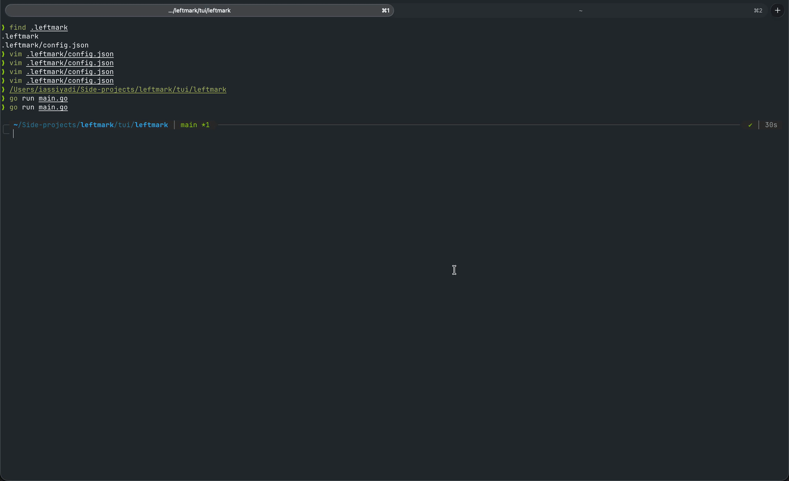

# leftmark

`leftmark` is a scanner for the TODOs, FIXMEs, notes, and questions you already leave in your codebase.

## Core idea

Every developer already writes notes while they work, they just write them as comments. A `TODO` scribbled next to a hacky fix, a `FIXME` on code that isn't quite right yet, a `QUESTION` for something to double-check later. That's a real backlog, but it's invisible: scattered across files, easy to forget, impossible to browse.

The goal of `leftmark` is not to give you another place to write notes. It's the opposite. Stop maintaining a separate notes app, and treat your codebase as the draft it already is. Write your thinking where the code lives. `leftmark` scans it and gives you a dashboard to browse it, without changing how you write comments.

In short:

- your codebase is the draft
- comments are the capture mechanism, not a separate notes file
- this app is where you browse and report on the marks you've left behind

`leftmark` is the scan/report engine plus a set of presentation layers on top of it. The first client is a terminal app, but the engine is built so a VS Code extension, an editor plugin, or other front-ends can be added later without changing how items are scanned.

## Demos

### TUI



### CLI

Coming soon.

## How it works

1. **Scan.** `leftmark` walks your project (respecting `.gitignore`) looking for `TODO`, `FIXME`, `NOTE`, and `QUESTION` comments, in any language. Every scan is fresh: nothing is written back to your source and nothing persists between runs.
2. **Browse.** A dashboard lists everything the last scan found, lets you move through items, open an in-app syntax-highlighted preview of the file at that line, and rescan on demand. The first dashboard is a terminal app; other front-ends can present the same scanned items later.
3. **Report.** An optional, informational-only git hook prints a count of items by kind at commit or push time. It never blocks, it's just a nudge.

## Product direction

- a fixed, opinionated marker vocabulary to start (`TODO`, `FIXME`, `NOTE`, `QUESTION`), not user-configurable yet
- no persistence layer: the source tree is scanned fresh every time, there's nothing external to keep in sync
- multi-language support via a lightweight comment-syntax table, not a full parser per language
- git hooks are informational by default; blocking/enforcement modes are a later, opt-in step
- browsing includes an in-app, read-only, syntax-highlighted preview of the file at the marker's line; `leftmark` doesn't shell out to an editor
- the scan/report engine is kept independent of any single presentation layer, so the terminal app, and any front-end added later, are just clients built on top of it

## Quality checks

This project uses standard Go quality tooling:

- `gofmt` for formatting
- `go vet` for baseline static analysis
- `golangci-lint` for additional lint checks

Install Go locally, and make sure `golangci-lint` is available in your shell.

Run the checks from the repository root:

```bash
make fmt
make vet
make lint
make check
```

`make check` validates formatting without rewriting files, then runs `go vet` and `golangci-lint`.

GitHub Actions runs the same checks on pull requests and pushes to `main`.

If you want Git to run checks before pushing, configure the repo-managed hooks once:

```bash
git config core.hooksPath scripts/git-hooks
```

The tracked `pre-push` hook runs `make fmt-check` before allowing a push.
